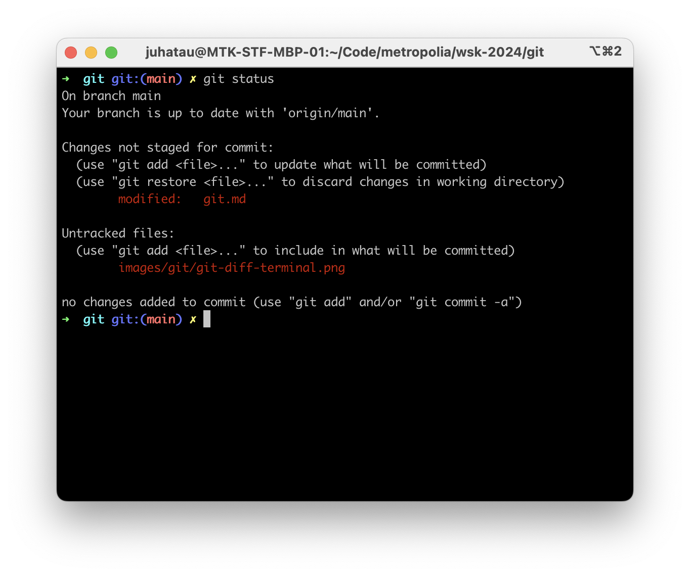
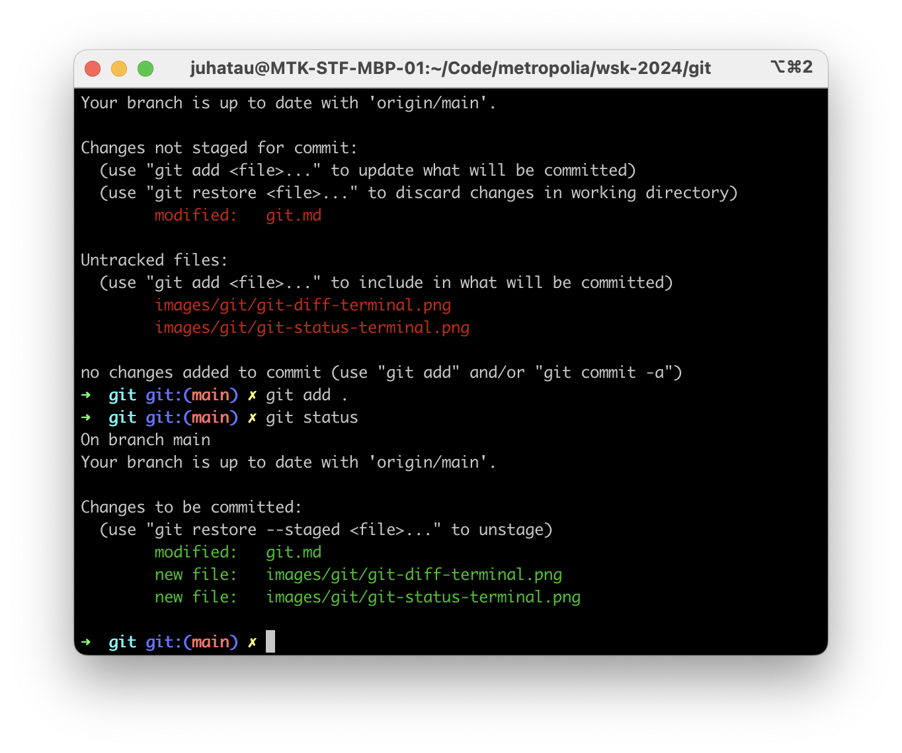
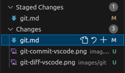
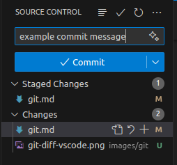
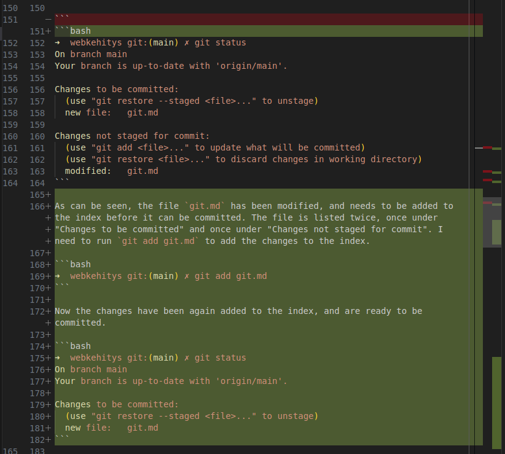
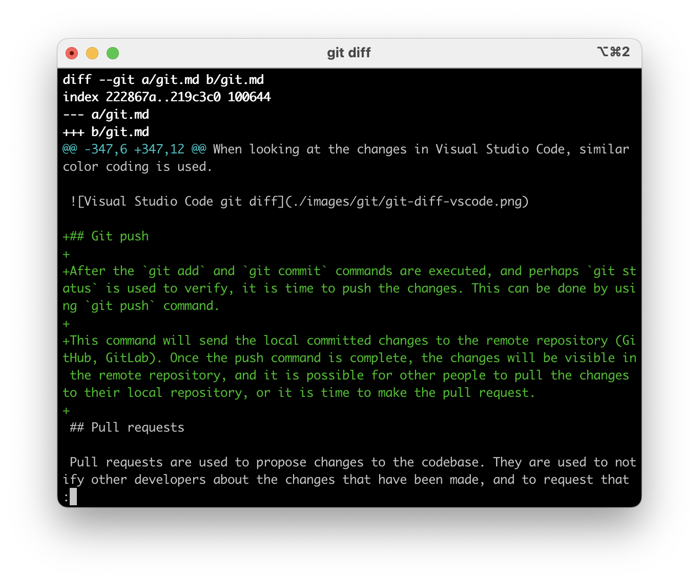

# Git

Git is a distributed version control system. It is used to track changes in the source code during the development of software. Originally developed by Linus Torvalds (of Linux fame) in 2005, Git has become the most widely used version control system in the world.

Version control systems are important part of the daily operations of any software project and software developer. Working in a team might be a bit difficult without it. Each developer can submit their changes to the codebase, which can then be easily copied by the other developers.

Git allows simultaneous work on the same codebase through the usage of branches, which we'll cover later in this material.


Have a look at the git website and wikipedia.

- [git-scm.com](https://git-scm.com/)
- [wikipedia entry for git](https://en.wikipedia.org/wiki/Git)

## Installation

Installation guide for different platforms can be found in git website, [https://git-scm.com/book/en/v2/Getting-Started-Installing-Git](https://git-scm.com/book/en/v2/Getting-Started-Installing-Git).

Some operating systems might have git included.

## Basic Commands

List of some common git commands:

- `git pull`
- `git add`
- `git commit`
- `git push`
- `git status`

These commands are enough for most of the day-to-day activities and will suffice well for most projects and for studies.

More advanced commands include:

- `git init` - Initialize a new git repository
- `git clone` - Clone a repository into a new directory
- `git add` - Add file contents to the index
- `git commit` - Record changes to the repository
- `git status` - Show the working tree status
- `git push` - Update remote refs along with associated objects
- `git pull` - Fetch from and integrate with another repository or a local branch
- `git branch` - List, create, or delete branches
- `git checkout` - Switch branches or restore working tree files
- `git merge` - Join two or more development histories together
- `git log` - Show commit logs
- `git diff` - Show changes between commits, commit and working tree, etc
- `git reset` - Reset current HEAD to the specified state
- `git tag` - Create, list, delete or verify a tag object signed with GPG
- `git fetch` - Download objects and refs from another repository
- `git remote` - Manage set of tracked repositories
- `git rebase` - Reapply commits on top of another base tip
- `git cherry-pick` - Apply the changes introduced by some existing commits
- `git revert` - Revert some existing commits
- `git stash` - Stash the changes in a dirty working directory away
- `git clean` - Remove untracked files from the working tree

Git has many commands, for now we only need the initial five basic commands for most operations.

## Note on git commands

Git commands are executed in terminal, in the folder where the `.git` directory is located. This is usually the root directory of the project. For example, if your project is located in absolute path of `/usr/home/username/projects/my-project`, you should navigate to that directory before running any git commands. Running any git commands outside of the root directory of the project will result in an error, or other unexpected behavior.

Git can also be used through graphical user interfaces, but we will only focus on the terminal commands in this material.

## Basic Workflow - git init

When creating a new project, the first step is to initialize a new git repository. This is done by running the `git init` command in the directory of the project. This will create a new `.git` directory in the root of the project, which will contain all the necessary files for the repository. The init command is only be run once, when the project is first created.

The `.git` folder is a hidden folder and we do not need to interact with it directly. It contains all the necessary files for the repository, such as the configuration, the index, the object database, and the logs. If some catastrophy happens, it is possible to delete the folder, but this should be left as the last resort. Instead, google the error message, ask around. Most likely the issue is not unique.

## .gitignore

The `.gitignore` file is used to specify files and directories that should be ignored by git. This is useful for files that are generated by the build process, or for files that contain sensitive information (such as passwords or API keys). The `.gitignore` file should be placed in the root directory of the project, and should contain a list of files and directories that should be ignored by git.

For example in javascript projects, the `.gitignore` file might look like this:

```
node_modules/
dist/
*.env
```

This will tell git to ignore the `node_modules` directory, the `dist` directory, and any file named `.env`.

It is _important_ to have a `.gitignore` file in your project, containing at minimum the `node_modules` directory. This is because the `node_modules` directory can be very large, and it is not necessary to include it in the repository. Instead, the `package.json` file should be used to specify the dependencies of the project, and it should be kept up to date with the latest versions of the dependencies.

Oftentime having the `dist/` folder in the git repository is undesired, as it contains the built files of the project, and can be easily regenerated by running the build process. Similarly the `.env` file should not be included in the repository, as it might contain sensitive information, such as passwords or API keys. Especially, if the git repository is public. There are plenty of good and bad services out there scanning for projects with `.env` files in them, which they can then use to gain access to the project. This access can compromise user security and cause financial damage.

GitHub provides an useful list of .gitignore templates in [https://github.com/github/gitignore](https://github.com/github/gitignore), for example useful for node.js (and other javascript) projects, have a look at [https://github.com/github/gitignore/blob/main/Node.gitignore](https://github.com/github/gitignore/blob/main/Node.gitignore).

Most contemporary tools, such as vite, create-react-app, and others, will create a `.gitignore` file for you, containing the necessary and relevant files and directories to be ignored by git.

## Branches

Branches are used to isolate changes in the codebase. This is useful for working on new features, or for fixing bugs, without affecting the main codebase. When a new branch is created, it is based on the current state of the codebase, and any changes made to the codebase will only affect the new branch. Once the changes are complete, the new branch can be merged back into the main codebase.

The `git branch` command is used to list, create, or delete branches. The `git checkout` command is used to switch branches or restore working tree files. The `git merge` command is used to join two or more development histories together.

`git checkout -b new-branch` - Create a new branch and switch to it. This command is equivalent to running `git branch new-branch` and then `git checkout new-branch`.

`git branch -d branch-name` - Delete the specified branch.

`git merge branch-name` - Merge the specified branch into the current branch.

When working on a new feature or fixing a bug, it is a good idea to create a new branch for the changes. This will isolate the changes from the main codebase, and will make it easier to merge the changes back into the main codebase once they are complete.

To check the current branch, run the following command `git branch`. The current branch will be indicated by an asterisk `*` next to the branch name.

Most distributed services, such as GitHub and GitLab, provide user interfaces for reviewing and approving the changes in branches. This will be covered later on the pull requests section.

### Feature Branches

Feature branches are used to isolate changes in the codebase that are related to a new feature. When a new feature is being developed, it is a good idea to create a new branch for the changes. This will isolate the changes from the main codebase, and will make it easier to merge the changes back into the main codebase once they are complete.

For example, to create a new branch for a new feature, run the following command:

`git checkout -b new-feature` - Create a new branch called `new-feature` and switch to it.

Oftentimes a good idea for naming convention is to name the feature branch something like `feature/feature-name`, or at minimum `feature-name`. This will make it easier to identify the purpose of the branch, and will make it easier to manage multiple feature branches.

## Git add

`git add` is used to add file contents to the index. This is the first step in the basic git workflow. When changes are made to the codebase, they need to be added to the index before they can be committed. This is done by running the `git add` command.

`git add .` - Add all changes to the index. The `.` is a wildcard that matches all files and directories in the current directory.

`git add -A` - Add all changes to the index. This is equivalent to running `git add .`.

`git add directory-name/` - Add all changes in the specified directory to the index.

`git add file-name` - Add the specified file to the index. This will stage the file for the next commit.

When making changes to the codebase, it is important to add the changes to the index before committing them. This will ensure that the changes are included in the next commit.

Running `git commit` without adding the changes to the index will result in an empty commit, and will not include the changes in the commit.

### Tips

A good convention would be to include files and folders relevant to each other to a single commit, instead of adding all changes. This will make it easier to understand the changes made in the commit.

For example if you have changes in files called `login-form.js`, `login-form.css`, `image-carousel.js`, and `image-carousel.css`, it would be a good idea to add the changes in logical groups, such as:

```bash
git add login-form.js login-form.css
git commit -m "Add new feature to login form"

git add image-carousel.js image-carousel.css
git commit -m "Add new feature to image carousel"
```

Keep in mind good commit message conventions, which will be covered later in this material.

### Example output of git add & git status

Running the `git status` command will show the changes that have been made to the codebase, and whether they have been added to the index.

```bash
➜  webkehitys git:(main) git status
On branch main
Your branch is up-to-date with 'origin/main'.

Untracked files:
  (use "git add <file>..." to include in what will be committed)
	git.md

nothing added to commit but untracked files present (use "git add" to track)
```

In this example, the file you are reading, `git.md` is untracked. This means that the changes have not been added to the index, and will not be included in the next commit.

Once the changes have been added to the index, running the `git status` command will show the changes that have been added to the index, and whether they are ready to be committed.

```bash
➜  webkehitys git:(main) ✗ git add .
```

Now all changes have been added to the index. Running `git status` will show the changes that have been added to the index.

```bash
➜  webkehitys git:(main) ✗ git status
On branch main
Your branch is up-to-date with 'origin/main'.

Changes to be committed:
  (use "git restore --staged <file>..." to unstage)
	new file:   git.md
```

As can be seen, `git.md` has been added to the index, and is ready to be committed.

In most terminals, git will output red color for untracked files, green color for added files.

Now that I've made some changes to this file, I need to add the changes to the index before I can commit them.

```bash
➜  webkehitys git:(main) ✗ git status
On branch main
Your branch is up-to-date with 'origin/main'.

Changes to be committed:
  (use "git restore --staged <file>..." to unstage)
	new file:   git.md

Changes not staged for commit:
  (use "git add <file>..." to update what will be committed)
  (use "git restore <file>..." to discard changes in working directory)
	modified:   git.md
```

As can be seen, the file `git.md` has been modified, and needs to be added to the index before it can be committed. The file is listed twice, once under "Changes to be committed" and once under "Changes not staged for commit". I need to run `git add git.md` to add the changes to the index.

```bash
➜  webkehitys git:(main) ✗ git add git.md
```

Now the changes have been again added to the index, and are ready to be committed.

```bash
➜  webkehitys git:(main) ✗ git status
On branch main
Your branch is up-to-date with 'origin/main'.

Changes to be committed:
  (use "git restore --staged <file>..." to unstage)
	new file:   git.md
```

#### Git status in terminal

Running git status with uncommitted changes:



After changes have been added:



### Changes in Visual Studio Code

When using Visual Studio Code, the changes that have been made to the codebase will be shown in the source control tab. The changes that have been made to the codebase will be shown in the source control tab, and the changes that have been added to the index will be shown in the staged changes section.

The changed files might look something like this:



In this screenshot, some changes have been staged (added to the index), and some changes have not yet been staged, meaning that `git add` command has not yet been executed for them.

## Commit Messages

`git commit -m "Example of commit message"` - Commit changes to the codebase with a descriptive message. The `-m` flag is used to specify the commit message. The message itself is enclosed in quotes. The message for this commit is "Example of commit message".

When making changes to the codebase, it is important to write clear and descriptive commit messages. This will make it easier to understand the changes that were made, and why they were made.

A good commit message should be concise, and should explain the reasoning behind the changes. It should also be written in the present tense, and should be no longer than 50 characters.

For example:

```
Add new feature
```

or

```
Fix bug in login form
```

From these two examples, it is not that clear what has been done. Instead, a more descriptive commit message might look like this:

```
Add new feature to allow users to reset their password
```

or

```
Fix bug in login form that was preventing users from logging in
```

Make sure that the commit message does not use past tense, such as `added`, `fixed`, `removed`, etc. Instead, use present tense, such as `add`, `fix`, `remove`, etc.

Examples of bad commit messages:

```
Added new feature
Fixed bug
Removed unused code
```

Instead, use descriptive commit messages with present tense:

```
Add new feature to allow users to reset their password
Fix bug in login form that was preventing users from logging in
Remove unused code from the login component
```

Make sure that the commit messages start with a capital letter, and do not end with a period.

One good rule of thumb is to imagine that the commit message completes the sentence `If applied, this commit will...`. This will help to write more descriptive commit messages.

```
If applied, this commit will Add new feature to allow users to reset their password
If applied, this commit will Fix bug in login form that was preventing users from logging in
If applied, this commit will Remove unused code from the login component
```

If past tense is used in the commit message, then the sentence will not make sense:

```
If applied, this commit will Added new feature
If applied, this commit will Fixed bug
If applied, this commit will Removed unused code
```

Note that many conventions exists and might differ from one project to another. These conventions mentioned in this document will suffice for most projects and be more than enough for studies. Git commit messages are indication of good code quality and good practices. When reading bad git commit messages, it is often an indication of bad code quality and bad practices.

For more information on writing good commit messages, see the following articles:

- [How to Write a Git Commit Message](https://cbea.ms/git-commit/) - make sure to read this article
- [FreeCodeCamp - How to Write Good Commit Messages: A Practical Git Guide](https://www.freecodecamp.org/news/writing-good-commit-messages-a-practical-guide/)

### Git commits in Visual Studio Code

When using Visual Studio Code, the commit message can be written in the text box at the bottom of the window. The commit message should be written in the text box, and the changes should be staged before the commit is made.



If you commit through vscode, or any other tool, make sure to follow the same conventions as when committing through the terminal.

## Git diff

`git diff` is used to show changes between commits, commit and working tree, etc. This is useful for reviewing the changes that have been made to the codebase, and for understanding the differences between different versions of the codebase.

Most often `git diff` is used to show the changes that have been made to the codebase since the last commit, showing the changes which have not yet been committed to the project. This tool can help developer review the changes before committing them. Especially helpful when working on many changes at once.

Example:

```bash
➜  webkehitys git:(main) ✗ git diff
diff --git a/git.md b/git.md
index 3e3e3e3..4e4e4e4 100644
--- a/git.md
+++ b/git.md
@@ -1,3 +1,5 @@
 []: # Path: git.md
 # GIT

+This is a new line added to the file.
+
-This is a line that has been removed from the file.
 ## Basic Commands
```

In the above example, the `git diff` command shows the changes that have been made to the file `git.md`. The `+` sign indicates that a new line has been added to the file. The `-` sign indicates that a line has been removed from the file. They are often color coded in most terminals, with green color for added lines, and red color for removed lines.

Once `git diff` is running, you can navigate through the changes using the arrow keys or space bar, and exit it by pressing the `q` key on the keyboard. Page up and page down keys can also be used for navigation.

### Visual studio code & git diff

When looking at the changes in Visual Studio Code, similar color coding is used. Green color for added lines, and red color for removed lines. Altough the UI might differ from the terminal, the information is the same.



### Terminal & git diff

`git diff` command might look something like this in terminal:



## Git push

After the `git add` and `git commit` commands are executed, and perhaps `git status` is used to verify, it is time to push the changes. This can be done by using `git push` command.

This command will send the local committed changes to the remote repository (GitHub, GitLab). Once the push command is complete, the changes will be visible in the remote repository, and it is possible for other people to pull the changes to their local repository, or it is time to make the pull request.

## Pull requests

Pull requests are used to propose changes to the codebase. They are used to notify other developers about the changes that have been made, and to request that the changes be reviewed and merged into the main codebase. They provide transparency and visibility into the changes that are being made, and allow other developers to provide feedback before the changes are merged.

When a new feature or bug fix is complete, a pull request should be created to notify other developers about the changes. This will allow other developers to review the changes, and to provide feedback before the changes are merged into the main codebase.

Consider the commits on your branch as being part of explaining the changes in your pull request. Some tools, such as GitHub, might use the commits as part of the pull request description content. Also, once the pull request is merged, the commits will be part of the main branch history and they might even appear in a change log, if one is generated.

Pull requests are used in every day activities in most software projects. They are reviewed by other developers, or other stakeholders, or even automated tools. The review process is used to ensure that the changes follow the project's coding standards, and that they do not introduce any new bugs or security vulnerabilities.

When creating a pull request, write a clear and descriptive title and description. The title should be concise, and should explain the purpose of the pull request. The description should be more detailed, and should explain the reasoning behind the changes, and any potential side effects.

When creating a pull request, it is possible to assign the pull request to the appropriate person, and to request a review from them. This will notify the person that the pull request is ready for review, and will allow them to provide feedback before the changes are merged into the main codebase. This of course depends on the platform used, such as GitHub, GitLab, Bitbucket, etc, as well as the project's policies, procedures, and conventions.

When working with multiple developers, even in a school settings, pull requests should be used to merge one's changes into the main codebase. At first it might feel a bit odd to create a pull request for your own changes, instead of just committing code to the main branch and pushing the changes. This is normal and expected, but still, use pull requests.

## Git pull

Once the changes are pushed to remote, it is possible to pull them to local repository. This is done by using `git pull` command.

This command will fetch the changes from the remote repository and copy them locally. If pull requests are used, this command will pull the changes from the pull request branch to the local repository. The pull request branch might not be the main branch, such as `main` or `master`, but instead it should be a feature branch, such as `feature/feature-name`.

Once the pull request is completed, the changes will be in the main branch.

Tip: if you are unsure of which changes are copied from remote to local, run `git log` command after git pull to see the git commit messages.

### Possible git pull issues

Sometimes `git pull` command will fail because local repository has uncommitted changes on the same files that are being pulled from remote.

These failures are usually called `conflicts`, and they are a normal part of the development process.

This can be solved by either committing the local changes, or by stashing them.

Protip: When working on a team project, first thing to do every day is to pull. Also when changing branches, pull. This shoud decrease the number of conflicts.

When a conflict happens, you need to slow down and figure out what is happening and why. Sometimes you need to consult the other developer who has made the changes. Sometimes the other developer is you.

## Git and GitHub (and other platforms)

While git and GitHub sound familiar and might seem synonymous, they are not. Git is a version control system, while GitHub is a web-based platform that provides hosting for software development and version control using Git. GitHub provides a number of features, such as bug tracking, feature requests, task management, and wikis for every project. It also provides a web-based graphical interface for working with git repositories.

Other similar platforms to GitHub include GitLab and Bitbucket.

When talking about git, it is important to understand the difference between git and GitHub, and to use the correct terminology when referring to them. For example commiting changes to a git repository is different from pushing changes to a GitHub repository.

One git repository might have multiple remotes, such as GitHub, GitLab, or Bitbucket. This allows the same codebase to be hosted on multiple platforms, and for changes to be pushed to all of them.

You might be reading this text on GitHub. Feel free to make a pull request to the material, if you find any errors, or if you have any suggestions for improvements. This will help you to understand the pull request process, and to get familiar with the GitHub platform, and it will help all of us by improving the material.
